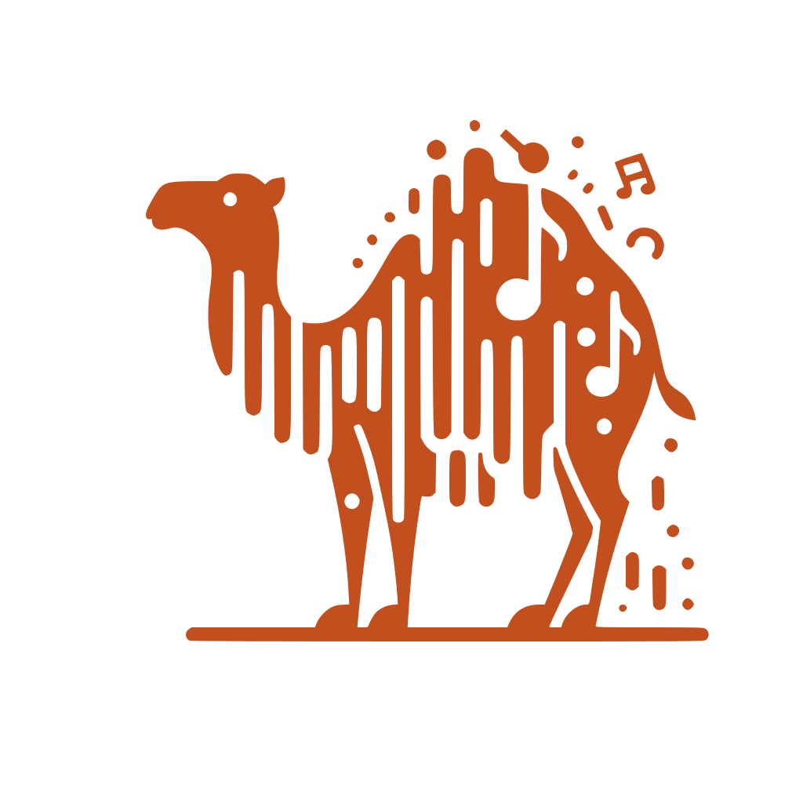

<div align='center'>



<h1>SoundML</h1>
<p>A little and very high level library to perform basic operations on audio files in the OCaml language</p>

<h4> <span> · </span> <a href="https://github.com/gabyfle/SoundML/blob/master/README.md"> Documentation </a> <span> · </span> <a href="https://github.com/gabyfle/SoundML/issues"> Report Bug </a> <span> · </span> <a href="https://github.com/gabyfle/SoundML/issues"> Request Feature </a> · </h4>


</div>

## About the Project

> [!WARNING]
> The project is still in development and is not yet ready for use.

## Getting Started

### Installation

This project uses Opam as a package manager
```bash
opam install soundml
```

## Roadmap

The project is still work in progress.

* [x] Read and Write audio
* [x] Audio slicing (in a similar way to Owl's slicing)
* [ ] Basic onset detection algorithms
* [ ] Spectral analysis
  * [x] Generic spectrogram helper function
  * [ ] Unify the spectrogram parameters inside a config module.
  * [X] Mel spectrogram
  * [X] MFCC spectrogram
  * [ ] Chroma spectrogram
  * [x] Constant and linear detrend
* [ ] Time domain analysis
  * [x] RMS computation 
  * [X] Zero crossing rate
* Effects module
  * [ ] Pitch shifting
  * [ ] Time stretching
  * [ ] Filters (low-pass, high-pass, band-pass, etc...)
* [ ] Write test files for the whole library 

## Features
 - Natively written in OCaml for a perfect OCaml developer experience
 - Easily read and write audio files in various formats (WAV, MP3, etc...)
 - Audio slicing
 - Feature extraction (MFCC, mel-spectrogram, ZCR, ...)
 - Audio effects (pitch shifting, time stretching, filters, ...)


## Requirements

You should be using the OCaml compiler with a version at least equal to 5.1.0. You can install it by following the instructions on the [OCaml website](https://ocaml.org/docs/install.html). This project uses the Dune build system.

This library heavily relies on the Owl and ocaml-ffmpeg libraries.

<div align=center>

| Name                                                                                                  | Version  | Description                                                                                        |
| ----------------------------------------------------------------------------------------------------- | -------- | -------------------------------------------------------------------------------------------------- |
| [**Owl**](https://github.com/owlbarn/owl) - *OCaml Scientific Computing*                              | `>= 1.1` | Library for scientific computing in OCaml. Used to make the heavy computations (FFT, IFFT, etc...) |
| [**ocaml-ffmpeg**](https://github.com/savonet/ocaml-ffmpeg) - *OCaml bindings to the FFmpeg library.* | `>= 1.2` | OCaml bindings for FFmpeg. Used to read and write audio data.                                      |

</div>

## Inspirations

This project is heavily inspired by other amazing open-source libraries such as:


<div align=center>

| Name                                              | Inspiration                                                                                                                                                                                                                                              | Reference                                                                                                                                                                                                                                 |
| ------------------------------------------------- | -------------------------------------------------------------------------------------------------------------------------------------------------------------------------------------------------------------------------------------------------------- | ----------------------------------------------------------------------------------------------------------------------------------------------------------------------------------------------------------------------------------------- |
| [**librosa**](https://github.com/librosa/librosa) | General functionalities for audio signal processing                                                                                                                                                                                                      | McFee, Brian, Colin Raffel, Dawen Liang, Daniel PW Ellis, Matt McVicar, Eric Battenberg, and Oriol Nieto. "librosa: Audio and music signal analysis in python." In Proceedings of the 14th python in science conference, pp. 18-25. 2015. |
| [**pydub**](https://github.com/jiaaro/pydub)      | Ease of use, audio slicing using milliseconds and manipulation                                                                                                                                                                                           | -                                                                                                                                                                                                                                         |
| [**Numpy**](https://numpy.org/)                   | Numerous implementation of SoundML's algorithms were directly taken from Numpy                                                                                                                                                                           | -                                                                                                                                                                                                                                         |
| [**Matplotlib**](https://matplotlib.org/)         | The implementation of their spectral helper to compute spectrogram as well as the one of the linear detrend function were took from the [`matplotlib.mlab`](https://github.com/matplotlib/matplotlib/blob/main/lib/matplotlib/mlab.py#L213-L373) module. | -                                                                                                                                                                                                                                         |

</div>

Don't hesitate to check the amazing work done by the authors and contributors of these libraries!

## License

Distributed under the Apache License Version 2.0. See LICENSE for more information.

## Acknowledgements

* Logo generated with DALL-E by OpenAI
